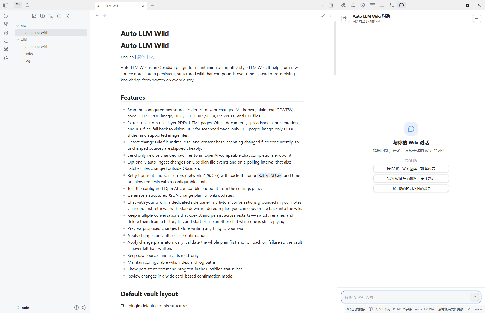

# ContextOS

[English](README.md) | 简体中文

ContextOS 是一个用于维护 Karpathy 风格 LLM Wiki 的 Obsidian 插件。它可以把原始来源笔记转化为持久、结构化、可持续积累的 Wiki，避免每次查询都从零重新推导知识。



## 功能

- 扫描已配置的原始来源文件夹，发现新增或变更的 Markdown、纯文本、CSV/TSV、代码、HTML、PDF、图片、DOC/DOCX、XLS/XLSX、PPT/PPTX 和 RTF 文件。
- 从带文本层的 PDF、HTML 页面、Office 文档、表格、演示文稿和 RTF 文件中抽取文本；对扫描版/纯图片 PDF 页面、纯图片 PPTX 幻灯片以及受支持的图片文件使用视觉 OCR。
- **并行 OCR**：PDF 页面 OCR 并发处理（可配置并发数，默认 3），多页扫描 PDF 速度提升 3–5 倍。
- 通过文件 mtime、大小和内容哈希检测变更，并发扫描变更文件，未变化的来源以极低成本跳过。
- **多提供商路由**：为文本操作（摄入、lint）、对话和视觉（OCR）分别配置不同的提供商。支持 OpenAI、Anthropic、Gemini、DeepSeek、Groq、Ollama 以及任意 OpenAI 兼容端点。
- 只把新增或变更的原始文件发送到 chat completions endpoint。
- 可选地在 Obsidian 文件事件和定时轮询时自动摄入变更（轮询还能捕获在 Obsidian 之外改动的文件）。
- 对瞬时错误（网络、429、5xx）带退避重试，遵循 `Retry-After`，并对慢请求施加可配置的超时。
- 在设置页测试已配置的 endpoint 是否可用。
- 为 Wiki 更新生成结构化 JSON 变更计划。
- 在专门的侧边聊天面板里与你的 Wiki 对话：多轮对话、以索引优先的方式基于你的笔记作答，回复以 Markdown 渲染，可复制或回填进 Wiki。
- **流式对话回复**：回复逐字流式输出，加载时显示三点动画，完成后渲染完整 Markdown。
- **基于嵌入的页面选择**（可选）：使用 Ollama、OpenAI 或 Qdrant embeddings 以向量相似度替代 LLM 调用来选取相关页面——对大 Wiki 更快更省 token。
- 多个会话并存并跨重启持久化——可在历史列表中切换、重命名、删除，并且在一个会话仍在回复时开启或使用另一个会话。
- 在写入 vault 之前预览拟议变更。
- 仅在用户确认后应用变更。
- 原子化应用变更计划：先校验整份计划，失败则回滚，绝不让 vault 处于写了一半的状态。
- 保持原始来源和资源文件只读。
- 维护可配置的 Wiki、索引和日志路径。
- 在 Obsidian 状态栏显示持久命令进度。
- 在宽版卡片式确认弹窗中审阅变更。
- **Git 集成**：自动将 Wiki 变更提交到本地或远程（SSH）git 仓库，支持自动生成 SSH 密钥和连接测试。

## 默认 vault 布局

插件默认使用以下结构：

```text
raw/             # 不可变来源笔记
raw/assets/      # 来源附件
wiki/            # 由 LLM 维护的 Wiki 页面
wiki/index.md    # 内容索引
wiki/log.md      # 最新在前的 ingest/chat/lint 日志
```

所有路径都可以在插件设置中配置。

## 支持的原始格式

- 文本和代码：`.md`、`.txt`、`.csv`、`.tsv`、`.json`、`.yaml`、`.yml`、`.log`、`.ts`、`.js`、`.py`、`.go`、`.rs`、`.java`、`.cpp`、`.sql`、`.sh`
- 网页：`.html`、`.htm`
- 文档：`.doc`、`.docx`、`.rtf`
- 表格：`.xls`、`.xlsx`
- 演示文稿：`.ppt`、`.pptx`
- PDF：`.pdf`
- 用于 OCR 的图片：`.png`、`.jpg`、`.jpeg`、`.webp`、`.gif`

PDF 和 PPTX 文件包含可读文本时会优先直接解析。只有 PDF 页面、PPTX 幻灯片或图片文件无法直接抽取文本时，才会使用视觉 OCR。

## 安装

### 从 Obsidian 社区插件市场安装

1. 在 Obsidian 中打开 **设置 → 社区插件**。
2. 如有需要，关闭 **安全模式**。
3. 选择 **浏览**，搜索 **ContextOS**。
4. 安装并启用插件。

### 开发安装

1. 安装依赖：

   ```bash
   npm install
   ```

2. 构建插件：

   ```bash
   npm run build
   ```

3. 将 `build/` 中的文件复制到你的 Obsidian vault 插件目录：

   ```text
   build/main.js       → <your-vault>/.obsidian/plugins/contextos/main.js
   build/styles.css    → <your-vault>/.obsidian/plugins/contextos/styles.css
   build/manifest.json → <your-vault>/.obsidian/plugins/contextos/manifest.json
   ```

4. 在 Obsidian 社区插件设置中启用 **ContextOS**。

## 配置

打开插件设置并配置：

- **Raw folder**：包含不可变来源文件的文件夹。受支持的原始输入包括 Markdown、纯文本、CSV/TSV、常见代码文件、HTML、PDF、PNG/JPEG/WebP/GIF 图片、DOC/DOCX、XLS/XLSX、PPT/PPTX 和 RTF。
- **Wiki folder**：生成的 Wiki 页面写入位置。
- **Assets folder**：只读附件文件夹。
- **Index path**：Wiki 索引文件路径。
- **Log path**：Wiki 日志文件路径。

### 提供商

在 **Providers** 区域配置一个或多个 LLM 提供商。每个提供商包含类型（OpenAI、Anthropic、Gemini、DeepSeek、Groq、Ollama 或 OpenAI 兼容）、API key、API URL 和模型名称。

使用 **操作路由** 栏为不同操作分配特定提供商：

| 操作 | 说明 |
|---|---|
| 默认提供商 | 当某操作未指定特定提供商时的回退 |
| 文本操作 | 摄入、lint、保存到 Wiki |
| 对话操作 | 聊天面板对话 |
| 视觉操作 | PDF OCR、图片 OCR |

例如：用一个便宜的模型（如 GPT-4.1 Mini）处理文本操作，用一个强大的模型（如 Claude Opus）驱动对话，用一个支持视觉的模型处理 OCR。

只要 URL 直接指向 `/v1/chat/completions` endpoint，也可以使用第三方 OpenAI 兼容提供商。点击 **Test connection** 用当前 URL、key 和 model 检查 endpoint 是否返回 HTTP 2xx——输入 API key 后也会自动测试连接。

### 提示词模板

自定义摄入、对话和 lint 的系统提示词。留空使用内置默认值。

### Embeddings（可选）

用向量相似度搜索替代 LLM 页面选择。在 **Embeddings** 区域配置：

| 后端 | 说明 |
|---|---|
| None（默认） | 当前 LLM 页面选择，无需改动。 |
| Ollama | 使用本地 Ollama embedding 模型（如 `mxbai-embed-large`）。向量存储在 `wiki/.embeddings/`。 |
| OpenAI | 使用 OpenAI embeddings API（`text-embedding-3-small` 等）。向量存储在 `wiki/.embeddings/`。 |
| Qdrant | 通过 Qdrant Cloud 使用完整向量数据库。embedding 和搜索均委托给 Qdrant。 |

启用后，embedding 会在摄入时自动计算并在对话查询时使用。如果 embeddings 文件夹为空或后端不可达，会回退到 LLM 页面选择。

### Git

每次变更计划应用后自动提交 Wiki 变更。在 **Git** 区域配置：

| 设置 | 说明 |
|---|---|
| Git 集成 | 关闭、仅本地或远程（SSH）同步。 |
| 连接方式 | SSH 手动设置（粘贴远程 URL）或 SSH 自动生成密钥（创建 Ed25519 密钥对）。 |
| 远程 URL | SSH 远程 URL（如 `git@github.com:user/repo.git`）。 |
| 提交后自动推送 | 每次本地提交后推送到远程。 |
| 测试连接 | 验证 Git 已安装且远程可达。 |

使用 SSH 自动生成密钥时，插件会在 `~/.ssh/` 中创建 Ed25519 密钥对并显示公钥——将其复制到 GitHub/GitLab 的 SSH 密钥设置中。输入远程 URL 后会自动测试连接。

### 高级设置

- **自动摄入原始文件变更**：默认关闭。开启后，受支持的原始文件变更会在短暂防抖后自动分析，并且通过验证的模型变更会直接应用，不再打开审阅弹窗。
- **自动摄入防抖（秒）**：开启自动摄入后，最后一次文件变更后等待这么久再分析。默认 3。
- **自动摄入轮询间隔（秒）**：开启自动摄入后，按此间隔扫描原始文件夹，以捕获在 Obsidian 之外改动的文件（如拖入的文件，它们不会触发文件事件）。默认 15；设为 0 关闭轮询。
- **OCR 页面并发数**：同时 OCR 的最大 PDF 页面数（默认 3）。配额受限的提供商请调低。
- **请求超时（秒）**：等待模型响应的最长时间，超时即报错。默认 900 秒；慢的本地模型或推理模型可调大，快的云端模型可调小。

## 使用

### 摄入变更的原始文件

1. 将受支持的来源文件放到已配置的 raw folder 下，例如 Markdown、文本、CSV/TSV、代码、HTML、PDF、图片、DOC/DOCX、XLS/XLSX、PPT/PPTX 或 RTF。
2. 运行命令：

   ```text
   将变更的原始文件导入 ContextOS
   ```

该命令会扫描已配置的 raw folder，处理所有新增或变更过的受支持原始文件。文本/代码类文件会直接读取，HTML 会转换为可读文本，Office 文档、表格、演示文稿和 RTF 文件会在本地抽取文本，带文本层的 PDF 会被直接抽取。扫描版或纯图片 PDF 页面、纯图片 PPTX 幻灯片会使用视觉 OCR（页面并发 OCR——可通过 OCR 页面并发数配置），受支持的图片文件也会发送给已配置的视觉模型进行 OCR，然后再摄入识别出的文本。已经成功应用过的文件会被跳过，直到其内容发生变化。

启用 **自动摄入原始文件变更** 后，插件会监听已配置 raw folder 中受支持文件的创建和修改。短暂防抖后，它会运行同一套摄入流程，并自动应用通过验证的变更，不再打开审阅弹窗。它还会按配置的间隔轮询原始文件夹，以捕获在 Obsidian 之外改动、不会触发文件事件的文件。自动摄入默认关闭。

命令流程：

1. 扫描 raw folder 中的变更文件，并在进度提示中显示受支持的 raw/PDF 候选文件。
2. 从文本/代码、HTML、PDF、图片、Office、表格、演示文稿和 RTF 输入中抽取来源文本；当 PDF 页面、PPTX 幻灯片或图片需要 OCR 时使用视觉 OCR。
3. 将变更来源和 Wiki 上下文发送给模型。
4. 验证返回的变更计划。
5. 显示审阅弹窗。
6. 仅在确认后应用变更。
7. 仅在变更成功应用后记录原始文件哈希。

### 与 Wiki 对话

从功能区（聊天图标）打开聊天面板，或运行：

```text
查询 ContextOS
```

这会在右侧边栏打开一个聊天面板。用自然语言提问，插件会基于你的 Wiki 作答：先读取索引，Wiki 较大时再让模型从索引中挑出相关页面、只钻取这些页面（索引优先检索）。如果配置了 embeddings，页面选择改用向量相似度搜索替代额外 LLM 调用。回复会逐字流式输出并显示三点加载动画，完成后渲染完整 Markdown。你可以**复制**回复，或用**保存到 Wiki**把有价值的答案经审阅式变更计划回填成一个页面（这次问答也会记录到 log 中），让探索随时间复利。

该面板支持多个会话：

- **新对话** 会开启一个全新会话，而不会丢弃当前会话。
- 历史列表（面板顶部的切换按钮）可在会话之间切换、**重命名**或**删除**（删除有二次确认）。
- 会话随插件一起保存，并在 Obsidian 重启后仍然保留。
- 等待是按会话独立的：一个会话仍在等待回复时，你可以开启或使用另一个会话，每条回复都会回到它自己的会话里。

### Lint Wiki

运行：

```text
检查 ContextOS
```

插件会要求模型将 Wiki 与当前的 raw 源对账，并查找过时声明、矛盾内容、缺失的交叉引用、重要概念缺页和数据缺口。由于 Wiki 是从多个来源蒸馏出的综合体，某个页面的 raw 源被删除时，通常会**修订**该页（删掉失去来源支撑的具体论断）而非整页删除；只有当页面已无任何留存价值时才删除。删除同样以变更计划的形式提出，需你审阅后才会应用（遵循 Karpathy 的设计：源不可变，对账与清理发生在 lint 时，而非删源后自动联动）。

## 安全模型

- 生成的变更计划永远不会修改原始文件。
- 资源文件被视为只读。
- 拒绝写入已配置 Wiki folder 之外的位置。
- 删除仅限于 Wiki folder 内，和其他变更一样需先预览，应用失败时会回滚。
- `indexPath` 和 `logPath` 必须位于已配置 Wiki folder 内。
- 拟议文件变更必须先审阅再应用。
- 仅在 Apply 成功后更新原始文件状态。

## 隐私和网络使用

此插件会将选定的 vault 内容发送到插件设置中配置的 OpenAI-compatible chat completions endpoint。摄入时，它会发送从受支持来源文件中抽取出的新增或变更原始文本，包括 Markdown、文本/代码、HTML、PDF、Office 文档、表格、演示文稿和 RTF 文件；当需要 OCR 时，它会将渲染后的 PDF 页面图片、PPTX 幻灯片中的嵌入图片或受支持的图片文件发送给已配置的模型，并附带 Wiki index/log 上下文。对话时，它会发送 Wiki 索引以及每一轮挑选出的相关页面，外加最近的会话消息；保存对话答案以及 lint 命令也会发送相关 Wiki 上下文。**Test OpenAI connection** 按钮会向已配置 endpoint 发送一个很小的 ping 式 chat completions 请求。除非你配置了 API URL 和 API key 并运行命令或点击测试按钮，否则插件不会发起网络请求。

API key 会本地存储在 Obsidian 插件数据中，并且只会作为 Authorization header 发送到已配置的 API URL。如果你配置了第三方 OpenAI-compatible endpoint，你的 API key 和选中的 vault 内容会发送给该 provider。

此插件不包含遥测、分析、广告或自更新机制。

## 开发

运行测试：

```bash
npm test
```

构建：

```bash
npm run build
```

生成的 `main.js` 会被 git 忽略，不应提交。
